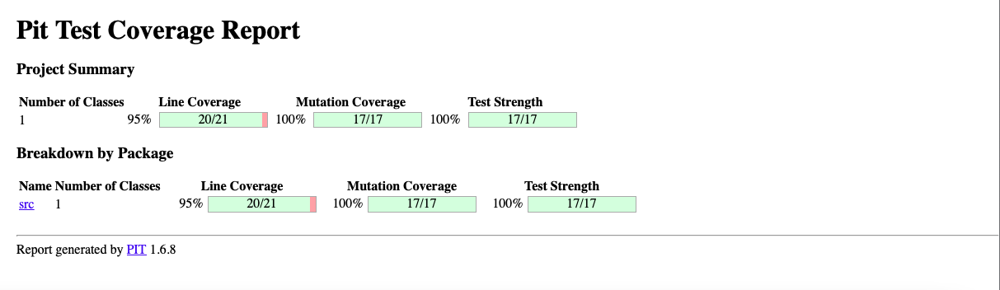

# Balanced strings

A string containing grouping symbols `{}[]()` is said to be balanced if every open symbol `{[(` has a matching closed symbol `]}` and the substrings before, after and between each pair of symbols is also balanced. The empty string is considered as balanced.

For example: `{[][]}({})` is balanced, while `][`, `([)]`, `{`, `{(}{}` are not.

Implement the following method:

```java
public static boolean isBalanced(String str) {
    ...
}
```

`isBalanced` returns `true` if `str` is balanced according to the rules explained above. Otherwise, it returns `false`.

Use the coverage criteria studied in classes as follows:

1. Use input space partitioning to design an initial set of inputs. Explain below the characteristics and partition blocks you identified.
2. Evaluate the statement coverage of the test cases designed in the previous step. If needed, add new test cases to increase the coverage. Describe below what you did in this step.
3. If you have in your code any predicate that uses more than two boolean operators check if the test cases written so far satisfy *Base Choice Coverage*. If needed add new test cases. Describe below how you evaluated the logic coverage and the new test cases you added.
4. Use PIT to evaluate the test suite you have so far. Describe below the mutation score and the live mutants. Add new test cases or refactor the existing ones to achieve a high mutation score.

Write below the actions you took on each step and the results you obtained.
Use the project in [tp3-balanced-strings](../code/tp3-balanced-strings) to complete this exercise.

## Answer
### Answer of exercice 3
##### Question 1
Here are the different test cases created:
* **"((()))"** => only the same symbol: return true
* **“(([]{}))”** => all the symbols : renvoie true
* **“(([]{}))a”** => all the symbols and text : return true
* **")([]{})("** => start with a closing ) : return false
* **“}([]{})(“** => start with a closing } : return false
* **“]([]{})(“** => start with a closing ] : return false
* **“”** => empty text, return true 
* **“text”** => only text, return true
* **"([{"** => only opening bracket, return false

##### Question 2
We use the eclipse option **Coverage As** with JUnit and we get a statement coverage of 98.6 %. We add the test where the string start with a closing **)**, **}** and **]** to get that coverage (Initially around 80 or 90%).
##### Question 3
The only line with two or more boolean operator is the line 10 : **if (l == '(' || l == '{' || l == '[') {**
expression = a OU b OU c with : 
* a = I == '('
* b = I == '{'
* c = I == '['
if l = ‘(‘ => exp = True
if l = ‘{‘ => exp = True
if l = ‘[‘ => exp = True
if I ∊ ASCII\{ ‘(‘ , ‘{‘ , ‘[‘ } => exp = False

##### Question 4
After installing Pitclipse, we start a Pit Test and get the following report :



The score is very great, there is one line which is not covered (probably because we get a statement coverage of 98.6%) but this line is the declaration of the class, so it will not cause any issue.


The PIT test used the following mutant : 


You will find below the class and the test class for this project :
```
public class App {
    public static boolean isBalanced(String s) {
    	//detect if a bracket of parentheses is balanced
    	ArrayDeque<Character> stack = new ArrayDeque<>();
        for (char l : s.toCharArray()) {

            if (l == '(' || l == '{' || l == '[') {
                stack.add(l);
            }
            else if (l == ')') {
                if (stack.isEmpty() || stack.getLast() != '(') {
                    return false;
                }
                stack.removeLast();
            }
            else if (l == '}') {
                if (stack.isEmpty() || stack.getLast() != '{') {
                    return false;
                }
                stack.removeLast();
            }
            else if (l == ']') {
                if (stack.isEmpty() || stack.getLast() != '[') {
                    return false;
                }
                stack.removeLast();
            }
        }
        return stack.isEmpty();
    }
}

```

```
public class App_Test {
  //create tests for the App.isBalanced method
  @Test
  public void testIsBalanced() {

    String s = "((()))";
    boolean expResult = true;
    boolean result = App.isBalanced(s);
    assertEquals(expResult, result);
  }

  //test with all symbols
  @Test
  public void testIsBalanced_AllSymbols() {

    String s = "(([]{}))";
    boolean expResult = true;
    boolean result = App.isBalanced(s);
    assertEquals(expResult, result);
  }

  //test with all symbols and extra symbols
  @Test
  public void testIsBalanced_AllSymbolsAndExtraSymbol() {

    String s = "(([]{}))a";
    boolean expResult = true;
    boolean result = App.isBalanced(s);
    assertEquals(expResult, result);
  }

  //test with a closing ) as a start
  @Test
  public void testIsBalanced_StartWithCloseBracket() {
    String s = ")([]{})(";
    boolean expResult = false;
    boolean result = App.isBalanced(s);
    assertEquals(expResult, result);
  }
  
  //test with a closing } as a start
  @Test
  public void testIsBalanced_OppositeAccolade() {
    String s = "}([]{})(";
    boolean expResult = false;
    boolean result = App.isBalanced(s);
    assertEquals(expResult, result);
  }
  
  //test with a closing ] as a start
  @Test
  public void testIsBalanced_OppositeCrochet() {
    String s = "]([]{})(";
    boolean expResult = false;
    boolean result = App.isBalanced(s);
    assertEquals(expResult, result);
  }

  //test with empty string
  @Test
  public void testIsBalanced_EmptyString() {

    String s = "";
    boolean expResult = true;
    boolean result = App.isBalanced(s);
    assertEquals(expResult, result);
  }

  //test with only text
  @Test
  public void testIsBalanced_OnlyText() {
    String s = "text";
    boolean expResult = true;
    boolean result = App.isBalanced(s);
    assertEquals(expResult, result);
  }


  //test with only opening brackets
  @Test
  public void testIsBalanced_OnlyOpening() {
    String s = "([{";
    boolean expResult = false;
    boolean result = App.isBalanced(s);
    assertEquals(expResult, result);
  }
}
```

