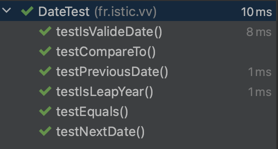
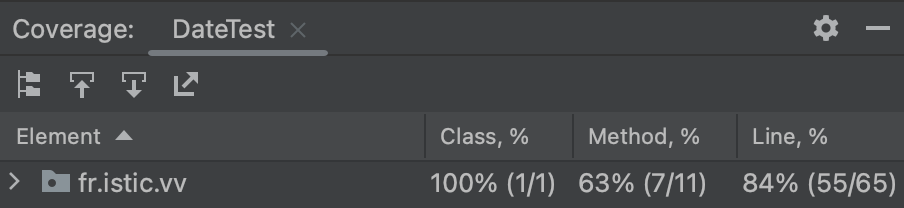
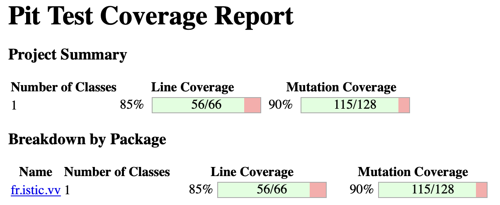

# Test the Date class

Implement a class `Date` with the interface shown below:

```java
class Date implements Comparable<Date> {

    public Date(int day, int month, int year) { ... }

    public static boolean isValidDate(int day, int month, int year) { ... }

    public static boolean isLeapYear(int year) { ... }

    public Date nextDate() { ... }

    public Date previousDate { ... }

    public int compareTo(Date other) { ... }

}
```

The constructor throws an exception if the three given integers do not form a valid date.

`isValidDate` returns `true` if the three integers form a valid year, otherwise `false`.

`isLeapYear` says if the given integer is a leap year.

`nextDate` returns a new `Date` instance representing the date of the following day.

`previousDate` returns a new `Date` instance representing the date of the previous day.

`compareTo` follows the `Comparable` convention:

* `date.compareTo(other)` returns a positive integer if `date` is posterior to `other`
* `date.compareTo(other)` returns a negative integer if `date` is anterior to `other`
* `date.compareTo(other)` returns `0` if `date` and `other` represent the same date.
* the method throws a `NullPointerException` if `other` is `null` 

Design and implement a test suite for this `Date` class.
You may use the test cases discussed in classes as a starting point. 
Also, feel free to add any extra method you may need to the `Date` class.


Use the following steps to design the test suite:

1. With the help of *Input Space Partitioning* design a set of initial test inputs for each method. Write below the characteristics and blocks you identified for each method. Specify which characteristics are common to more than one method.
2. Evaluate the statement coverage of the test cases designed in the previous step. If needed, add new test cases to increase the coverage. Describe below what you did in this step.
3. If you have in your code any predicate that uses more than two boolean operators check if the test cases written to far satisfy *Base Choice Coverage*. If needed add new test cases. Describe below how you evaluated the logic coverage and the new test cases you added.
4. Use PIT to evaluate the test suite you have so far. Describe below the mutation score and the live mutants. Add new test cases or refactor the existing ones to achieve a high mutation score.

Use the project in [tp3-date](../code/tp3-date) to complete this exercise.

## Answer

### Answer of exercice 4
##### Question 1

| Case                                | Input         | Output    |  
| -------------                       |:-------------:|:---------:|
| **nextDate()**                          |               |           |
| Fin d'année                         | 31/12/2010    | 01/01/2011|
| Fin du mois                         | 31/08/2010    | 01/09/2010|
| Fin d'une journée                   | 13/12/2010    | 14/12/2011|
| Fin du mois de février non bisextile| 28/02/2010    | 01/03/2010|
| Fin du mois de février bisextile    | 29/02/2010    | 01/03/2010|
| **previousDate()**                      |               |           |
| Début d'année                       | 01/01/2011    | 31/12/2010|
| Début du mois                       | 01/09/2010    | 31/08/2010|
| Début d'une journée                 | 14/12/2011    | 13/12/2010|
| Début du mois de mars non bisextile | 01/03/2010    | 28/02/2010|
| Début du mois de mars bisextile     | 01/03/2010    | 29/02/2010|
| Fin du mois de février non bisextile| 28/02/2010    | 27/02/2010|
| Fin du mois de février bisextile    | 29/02/2010    | 28/02/2010|
| **isLeapYears()**                       |               |           |
| Année bisextile                     | 01/01/2016    | True      |
| Année non bisextile                 | 01/01/2017    | False     |
| **isvalid()**                           |               |           |
| Date valide                         | 01/01/2017    | True      |
| Date au format incorrect            | 12/01/2017    | False     |
| Date invalide                       | helloWorld    | False     |
| **compareTo()**                         |               |           |
| Date égale                          | D1=D2         | 0         |
| Date non égale (année inférieur)    | D1.year < D2.year | -1    |
| Date non égale (année supérieur)    | D1.year > D2.year | 1     |
| Date non égale (mois inférieur)     | D1.month < D2.month | -1  |
| Date non égale (mois supérieur)     | D1.month > D2.month | 1   |
| Date non égale (jour inférieur)     | D1.day < D2.day | -1      |
| Date non égale (jour supérieur)     | D1.day > D2.day | 1       |


##### Question 2 and 3
After implementing the **Date** class, we wrote a test class for it. As seen in the course, we have a test method for an associated method of the initial class. Note that during the writing we did not write test cases for the getter and setter. After the first implementation of the tests, we obtain a coverage of 72%.  The standard is to have a coverage between 80-85%. We then add tests to reach this level of coverage.




##### Question 4
We will now use PIT to get a mutation level. This level allows us to know if we can trust our tests. With a Maven project we can use this command :
```
mvn test-compile org pitest:pitest-maven:mutationCoverage
```
With our project, here is Pittest's report :



